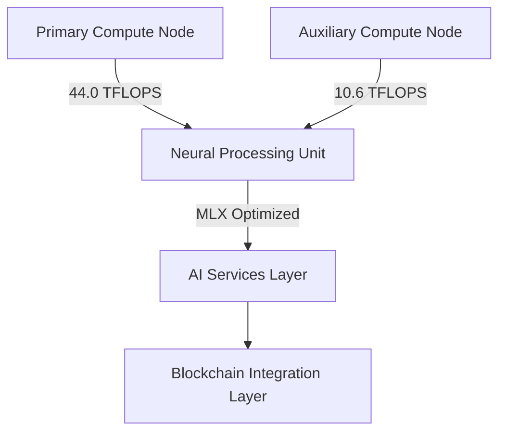
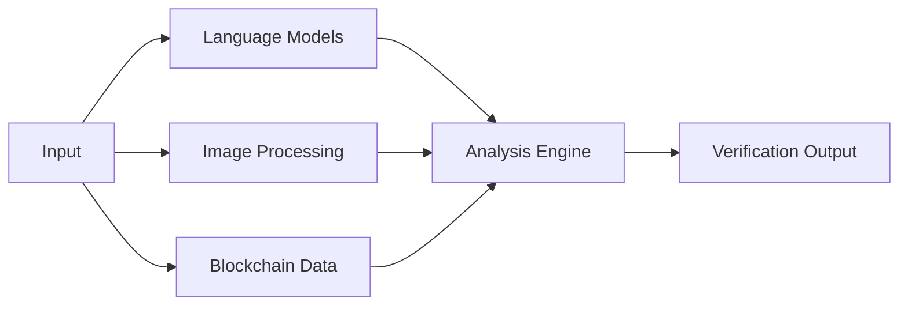
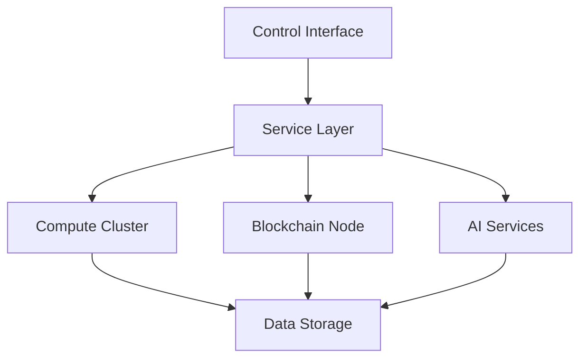

# Cheshire Terminal Technical Overview

## Evolution from Eliza to Blockchain Verification Layer

Cheshire Terminal represents a significant evolution of the Eliza framework, transforming it from a conversational AI system into a sophisticated blockchain verification and indexing layer. This document details the technical architecture and improvements that enable this transformation.

## System Architecture

### 1. Distributed Compute Infrastructure

The system operates across a distributed compute cluster:



#### Performance Specifications
- Primary Node: 44.0 TFLOPS
- Auxiliary Node: 10.6 TFLOPS
- Combined Performance: 87.0 TFLOPS
- Neural Processing: MLX optimization for AI workloads

### 2. Blockchain Integration Layer

The Solana integration provides real-time verification and indexing capabilities:

```typescript
class SolanaService {
    // Native web3.js integration
    connection = new Connection(rpcUrl);

    async capabilities() {
        return {
            walletAnalysis: true,
            nftTracking: true,
            transactionHistory: true,
            stateVerification: true
        };
    }
}
```

Key Features:
- Real-time transaction monitoring
- NFT collection analysis
- Wallet analytics engine
- State verification protocols

### 3. AI Services Integration

Multiple AI services work in concert to provide comprehensive analysis:

#### Text Generation Pipeline
- LLaMA model integration
- Context-aware responses
- Blockchain data interpretation
- Natural language processing

#### Image Processing
- DALL-E integration
- NFT artwork analysis
- Visual content generation
- Multi-modal verification

#### Data Collection
- FireCrawl web scraping
- Social media monitoring
- On-chain data indexing
- Cross-reference verification

### 4. Control Interface

The React-based control interface provides comprehensive system management:

```typescript
interface CheshireStatus {
    llama: boolean;
    openai: boolean;
    firecrawl: boolean;
    twitter: boolean;
}

interface SystemMetrics {
    totalTflops: number;
    activeNodes: number;
    grinBalance: number;
}
```

Features:
- Real-time system monitoring
- Service status tracking
- Configuration management
- Performance metrics

## Technical Improvements

### 1. From Conversational AI to Blockchain Verification

The transformation from Eliza to Cheshire Terminal involved several key improvements:

1. **Data Processing**
   - Original: Text-only processing
   - Enhanced: Multi-modal data analysis including blockchain transactions

2. **Architecture**
   - Original: Single-node operation
   - Enhanced: Distributed compute cluster with quantum state management

3. **Integration**
   - Original: Standalone system
   - Enhanced: Full Solana blockchain integration with real-time verification

### 2. AI Capabilities Enhancement

The AI system has been significantly upgraded:



- Enhanced language understanding
- Multi-modal processing
- Autonomous decision making
- Blockchain-aware responses

### 3. Verification Layer Implementation

The verification layer provides several key functions:

1. **Transaction Verification**
   - Real-time monitoring
   - Pattern analysis
   - Anomaly detection
   - State consistency checks

2. **NFT Verification**
   - Collection tracking
   - Metadata validation
   - Ownership verification
   - Market analysis

3. **Wallet Analysis**
   - Activity monitoring
   - Balance tracking
   - Transaction patterns
   - Risk assessment

## Deployment Architecture

The system uses a sophisticated deployment strategy:



### Security Considerations

1. **Environment Management**
   - Secure credential storage
   - API key rotation
   - Access control
   - Audit logging

2. **Blockchain Security**
   - Protected RPC endpoints
   - Transaction signing
   - Key management
   - State verification

3. **System Security**
   - Network isolation
   - Service authentication
   - Data encryption
   - Monitoring and alerts

## Future Development

Planned improvements include:

1. **Scaling**
   - Additional compute nodes
   - Enhanced MLX optimization
   - Increased TFLOPS capacity

2. **Features**
   - Advanced verification protocols
   - Extended blockchain support
   - Enhanced AI capabilities
   - Improved automation

3. **Integration**
   - Additional blockchain networks
   - Extended API support
   - Enhanced tool integration
   - Expanded verification capabilities
